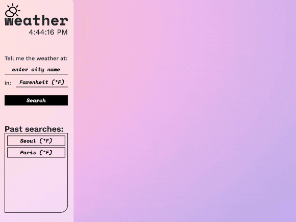

# Weather Dashboard

## Description
This application allows users to search weather conditions of a city. Users are able to select the temperature units when making their search. In addition, past searches are logged in a search history, so users can revisit weather conditions of cities searched before.

## Installation
N/A

## Usage
To search, click on the input and input a city. If the search entry is not a city, then an invalid message will pop up. Otherwise, users will see the current weather conditions and the five-day forecast of their search. Furthermore, users can click on the buttons in the Past Searches box to see the weather forecast of that city in the specified units.

### Search functionality demonstration

### Past search functionality demonstration

Link to deployed application: https://graceee96.github.io/weather-dashboard

## Credits
Icon in header (sun behind cloud) from Google Icons.

### APIs used
* Bootstrap v5.1.3
* OpenWeather

### Tutorials Referenced
* Eamonn Cottrell - How to Create Grainy CSS Backgrounds Using SVG Filters (https://www.freecodecamp.org/news/grainy-css-backgrounds-using-svg-filters/)
* Kevin Powell - Fun ways to animate CSS gradients (https://youtu.be/f3mwKLXpOLk)
* Stephanie Eckles - Custom Select Styles with Pure CSS (https://moderncss.dev/custom-select-styles-with-pure-css/)

## License
Please refer to LICENSE in the repository